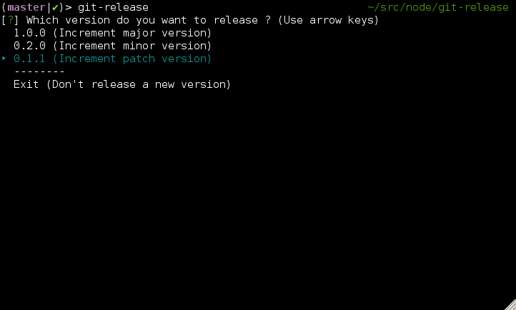

# git-release

> Release a new version of your Git project



## Installation

Install with npm

```shell
npm install -g git-release
```

## Usage

```shell
git-release
```

By default, this will
* increment the patch version (ex: from 1.2.0 to 1.2.1) in the package.json file using the [Semantic Versioning specification](http://semver.org/)
* commit the package.json file
* create a Git tag for the new version
* push to the remote server

You can also increment the minor version (ex: from 1.2.0 to 1.3.0)

```shell
git-release minor
```

Or the major version  (ex: from 1.2.0 to 2.0.0)

```shell
git-release major
```

Or force a specific version

```shell
git-release 1.3.0-alpha
```
